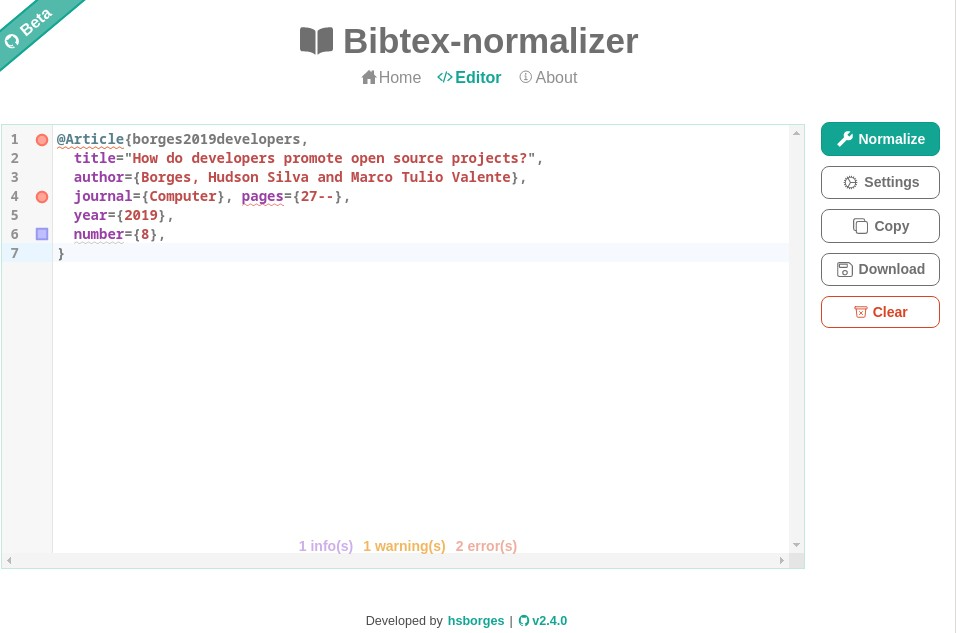

# 🕮 Bibtex Normalizer

Bibtex-normalizer is an open source project to validate and normalize Bibtex entries online. This tool uses a defined standard to organize your references in a single way, making it easier to read.

<a href="https://hsborges.github.io/bibtex-normalizer">https://hsborges.github.io/bibtex-normalizer</a>

## Authors

- [@hsborges](https://www.github.com/hsborges)
- [@paulo-carvalho](https://www.github.com/paulo-carvalho)

## Feedback

If you have any feedback, please open an issue on this repository.

## Related

BibTeX Tidy - https://github.com/FlamingTempura/bibtex-tidy
