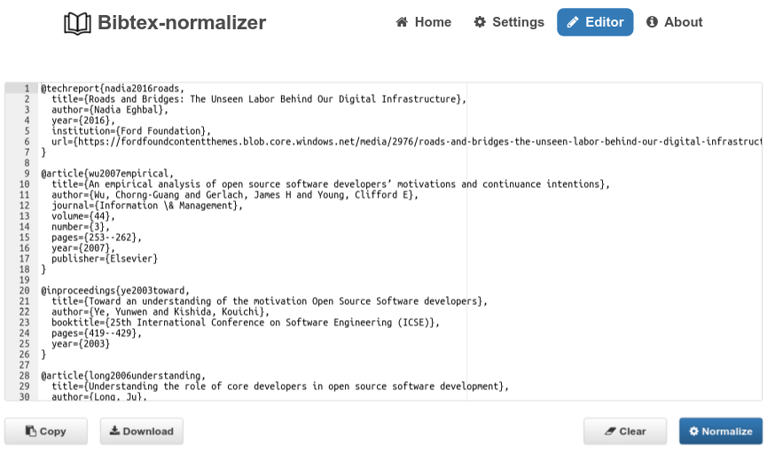
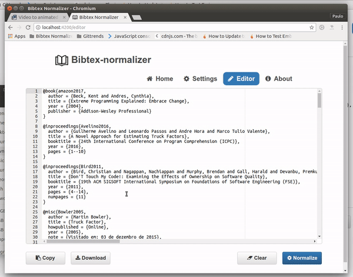

# Bibtex-normalizer
> Normalizing BibTeX entries to a common format

Bibtex-normalizer is an open source project to validate and normalize Bibtex entries online.
This tool uses a defined standard to organize your references in a single way, making it
easier to read.


## How it works

We normalize your references.bib in a simple way! If this is your first time here, you may need to follow these steps:

**Step 1**: access the main page via https://hsborges.github.io/bibtex-normalizer/:


**Step 2**: you can either:

* drag your references file at "Home" tab


* edit your references from scratch on "Editor" tab



**Step 3**: after an automatic normalization process, Bibtex-normalizer lists all of potential issues regarding Bibtex standards. Those issues may be one of the following:


* unnecesary fields
* missing fields from Bibtex entries
* unformatted fields regarding Bibtex standards


**Step 4**: edit your file online to fix those issues and click on "Normalize".


**Step 5**: with your normalized file, you can copy to your clipboard or save as a new Bibtex file (.bib).




**Step 6**: you can adjust those issues in "Settings" tab, check or uncheck your attributes and/or entries that your file needs to be normalized. Don't forget to Save your changes.


## Developing

This project uses Ember.js as framework for web applications. More information about Ember.js, we suggest you to [check Ember website](https://www.emberjs.com/).

### Building


### Deploying / Publishing

In case there's some step you have to take that publishes this project to a
server, this is the right time to state it.

```shell
packagemanager deploy awesome-project -s server.com -u username -p password
```

And again you'd need to tell what the previous code actually does.

## Features

What's all the bells and whistles this project can perform?
* What's the main functionality
* You can also do another thing
* If you get really randy, you can even do this

## Configuration

Here you should write what are all of the configurations a user can enter when
using the project.

#### Argument 1
Type: `String`  
Default: `'default value'`

State what an argument does and how you can use it. If needed, you can provide
an example below.

Example:
```bash
awesome-project "Some other value"  # Prints "You're nailing this readme!"
```

#### Argument 2
Type: `Number|Boolean`  
Default: 100

Copy-paste as many of these as you need.

## Contributing

When you publish something open source, one of the greatest motivations is that
anyone can just jump in and start contributing to your project.

These paragraphs are meant to welcome those kind souls to feel that they are
needed. You should state something like:

"If you'd like to contribute, please fork the repository and use a feature
branch. Pull requests are warmly welcome."

If there's anything else the developer needs to know (e.g. the code style
guide), you should link it here. If there's a lot of things to take into
consideration, it is common to separate this section to its own file called
`CONTRIBUTING.md` (or similar). If so, you should say that it exists here.

## Licensing

One really important part: Give your project a proper license. Here you should
state what the license is and how to find the text version of the license.
Something like:

"The code in this project is licensed under MIT license."
