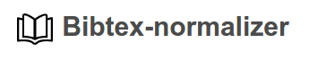
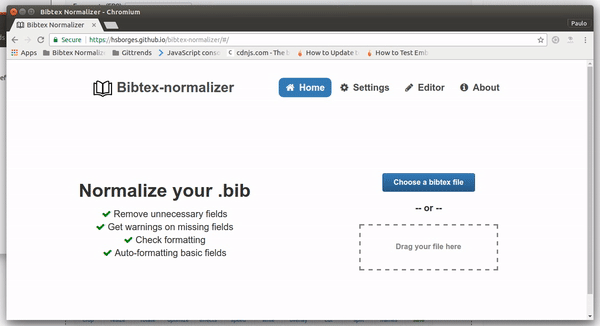

Bibtex-normalizer is an open source project to validate and normalize Bibtex entries online.
This tool uses a defined standard to organize your references in a single way, making it
easier to read.

  

## Usage

We normalize your references.bib in a simple way! If this is your first time here, you may need to follow these steps:

**Step 1**: Access the [website](https://hsborges.github.io/bibtex-normalizer)

**Step 2**: Select or drag and drop your bibtex file. You can also click on tab "Editor" to use the web editor.

**Step 3**: After the normalization process, a lists of potential issues is presented.

* *Auto-formatted fields:* Fields automatically formmated by the tool (details below).
* *Missing fields:* Mandatory fields that are not present (see "Settings").
* *Unformatted fields:* Fields not following Bibtex standards.

  *Note*: Fields not configured as mandatory on "Settings" are automatically removed from the formatted bibtex.

**Step 4**: Verify the issues list and click on "Normalize" button to check the references again.

**Step 5**: Copy the the normalized references to the clipboard or download it.

## Define your own configuration

Make adjustments on your normalization process accessing "Settings" tab, checking entries and attributes that your file needs to be normalized. Don't forget to save your changes.

*Note*: Configuration requires permission to use cookies.

## Developing

This project uses Ember.js as framework for web applications. More information about Ember.js, we suggest you to [check Ember website](https://www.emberjs.com/).
